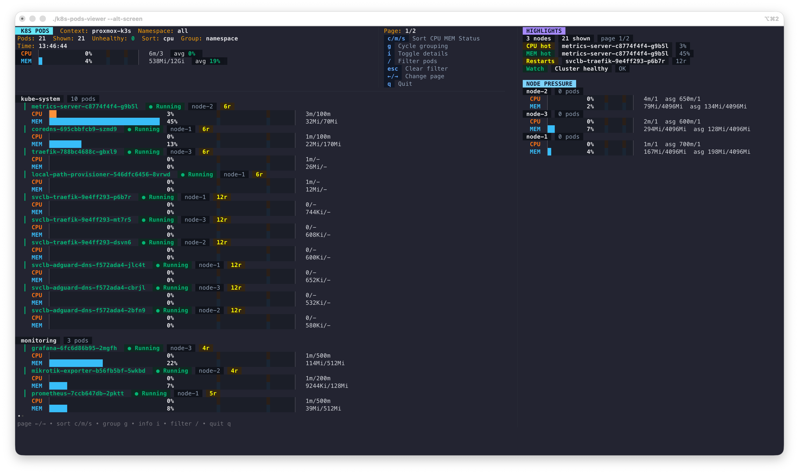

# k8s-pods-viewer

`k8s-pods-viewer` is a keyboard-first terminal UI for watching live pod CPU and memory usage in Kubernetes.

It is designed for the common questions behind noisy clusters: which pods are using CPU and memory right now, how does that compare to requests and limits, which nodes are carrying the pressure, and what can I do about a selected pod without leaving the viewer.

> Inspired by [awslabs/eks-node-viewer](https://github.com/awslabs/eks-node-viewer).

## Quick Install

> Recommended install:

```bash
brew install lavluda/tap/k8s-pods-viewer
```

## Preview



## What It Shows

- A live pod list with separate `cpu` and `memory` bars
- Keyboard pod selection that follows the exact rendered on-screen order
- A contextual right-side popup menu for the selected pod
- Pod actions for `exec`, `logs`, `describe`, `kill pod`, `scale -1`, and `scale +1`
- Multi-container handling for `exec` and `logs`, with a container picker when needed
- Inline confirmation for dangerous actions with keyboard-selectable `Confirm` / `Cancel`
- In-app scrollable viewers for `logs` and `describe`
- Namespace, workload, or flat grouping for pod rows
- Semantic pod status indicators that prefer current readiness over stale restart history
- Keyboard sorting for `cpu`, `memory`, and `status`
- Live `/` filtering across pod, namespace, workload, and node names
- Compact node aliases with a detailed info toggle
- A right-side node panel with per-node CPU and memory usage
- A top dashboard header with context, cluster summary, and keyboard shortcuts
- A right-side highlights rail for hot pods, restart visibility, and cluster watch status
- Direct initial pod/node fetch before watches start, so the UI can render immediately
- Recovery-friendly watch status reporting instead of crashing the TUI on informer/poller failures
- Cluster-level CPU and memory summary at the top
- Filters for namespace, pod labels, and node labels

By default the screen refreshes every `1s`.

The viewer runs in the normal terminal screen by default for better compatibility with terminals that clip the first rows in alt-screen mode. If you prefer the alternate screen buffer, use `--alt-screen`.

## Bar Semantics

The UI intentionally shows two different kinds of numbers:

- Pod bars: `% of live usage / pod baseline` with the percentage shown inside the bar
- Pod value text: `live usage / baseline`
- Node panel percentage: `live node usage / node allocatable`
- Node panel `asg/lim`: `sum of pod requests on the node / node allocatable`

For pods, the baseline is usually the limit when present, and falls back to the request when there is no limit. That means a pod line can show `500m/1200m` while the bar itself is still based on actual live usage from the metrics API.

## Health Semantics

- `Running` and ready pods are healthy
- `NotReady`, `Pending`, restart loops, and waiting states are surfaced as warning or critical
- `Failed` pods are critical
- Status sorting uses the computed health severity rather than raw phase text
- The top `Unhealthy` count reflects pods currently classified as warning or critical

## Requirements

- Access to a Kubernetes cluster via `kubeconfig`
- Permission to `list/watch` `pods` and `nodes`
- Permission to read pod metrics from `metrics.k8s.io`
- A working `metrics.k8s.io` provider, typically Metrics Server

If pod metrics are unavailable, the tool will still connect to the cluster, but live usage bars will not be meaningful until metrics are available.

## Install

### Homebrew

```bash
brew install lavluda/tap/k8s-pods-viewer
```

### Go install

```bash
go install github.com/lavluda/k8s-pods-viewer/cmd/k8s-pods-viewer@latest
```

### Build from source

```bash
git clone https://github.com/lavluda/k8s-pods-viewer.git
cd k8s-pods-viewer
make build
```

The binary will be available as `./k8s-pods-viewer`.

## Quick Start

Use your current kubeconfig context:

```bash
k8s-pods-viewer
```

Run directly from source:

```bash
go run ./cmd/k8s-pods-viewer
```

Use all namespaces explicitly:

```bash
k8s-pods-viewer --namespace all
```

## Examples

Watch a single namespace:

```bash
k8s-pods-viewer --namespace production
```

Filter pods by label:

```bash
k8s-pods-viewer --pod-selector app=api
```

Filter nodes by label:

```bash
k8s-pods-viewer --node-selector karpenter.sh/nodepool=default
```

Sort by memory usage descending:

```bash
k8s-pods-viewer --pod-sort memory=dsc
```

Sort by creation time ascending:

```bash
k8s-pods-viewer --pod-sort creation=asc
```

Use a specific kubeconfig and context:

```bash
k8s-pods-viewer \
  --kubeconfig ~/.kube/config \
  --context my-cluster
```

## Configuration File

The tool reads optional defaults from:

```text
~/.k8s-pods-viewer
```

Format:

```ini
context=my-cluster
kubeconfig=/Users/you/.kube/config
namespace=production
node-selector=karpenter.sh/nodepool=default
pod-selector=app=api
pod-sort=cpu=dsc
resources=cpu,memory
style=#04B575,#FFFF00,#FF0000
alt-screen=false
```

CLI flags override config file values.

## Flags

```text
-attribution
    Show the Open Source Attribution
-context string
    Name of the kubernetes context to use
-kubeconfig string
    Absolute path to the kubeconfig file
-namespace string
    Namespace to watch; empty means all namespaces
-node-selector string
    Node label selector used to filter nodes
-pod-selector string
    Pod label selector used to filter pods
-pod-sort string
    Sort order for pods. Examples: cpu=dsc, memory=asc, creation=dsc, namespace=asc
-resources string
    List of comma separated resources to monitor (default: cpu,memory)
-style string
    Three colors for styling 'good', 'ok' and 'bad' values
-alt-screen
    Run in the terminal alternate screen buffer
-v, -version
    Display k8s-pods-viewer version
```

## Controls

- `↑/↓`: move pod selection
- `←/→`: change page
- `enter`: open the selected pod action menu
- `c`: sort by CPU
- `m`: sort by memory
- `s`: sort by status
- `g`: cycle grouping (`namespace`, `workload`, `flat`)
- `i`: toggle compact vs detailed mode
- `/`: filter pods
- `esc`: clear filter, close a popup, or back out of confirmation
- `q`: quit

## Pod Actions

Press `enter` on the selected pod to open the popup menu.

- `Exec`: opens `kubectl exec -it ... -- sh`
- `Logs`: opens recent pod logs in the built-in viewer
- `Describe`: opens `kubectl describe pod` in the built-in viewer
- `Kill Pod`: runs `kubectl delete pod --wait=false`
- `Scale -1`: decreases the owning scalable workload by one replica
- `Scale +1`: increases the owning scalable workload by one replica

Scale actions appear only when the selected pod belongs to a scalable workload such as a Deployment or StatefulSet.

If a pod has multiple regular containers, `exec` and `logs` first open a container picker.

Dangerous actions use a confirmation step. The confirm popup supports:

- `←/→`, `↑/↓`, `h/l`, `j/k`, or `tab`: switch between `Confirm` and `Cancel`
- `enter`: activate the focused button
- `esc`: cancel and return to the action menu

## Log And Describe Viewer

The built-in output viewer is used for pod logs and describe output.

- `↑/↓` or `j/k`: scroll
- `pgup` / `pgdn` or `b/f`: page scroll
- `g`: jump to top
- `G`: jump to bottom
- `esc` or `q`: close the viewer

## Development

Run tests:

```bash
GOCACHE=/tmp/eks-pods-view-go-cache go test ./pkg/... ./cmd/...
```

Generate attribution files:

```bash
make generate
```

Build locally:

```bash
make build
```

Run the release flag matrix:

```bash
make test-release
```

## Acknowledgments

This project was inspired by [awslabs/eks-node-viewer](https://github.com/awslabs/eks-node-viewer).
While eks-node-viewer focuses on node-level cost and capacity, k8s-pods-viewer
focuses on live pod-level resource usage across any Kubernetes cluster.

## License

This project is licensed under Apache-2.0. See [LICENSE](LICENSE).

See [NOTICE](NOTICE) and [ATTRIBUTION.md](ATTRIBUTION.md) for third-party acknowledgments.
